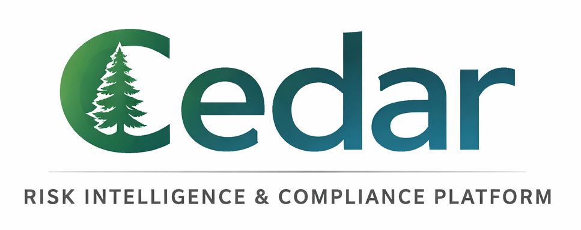

# AZURE_MIGRATION_GUIDE.md
## CedarGuard Gov — Azure Stack Migration (Engineering Reference)

---

## Section 0 — Who this is for

This document is for a junior or mid-level engineer joining the `cedarguard-gov-azure` build. Read it before opening any file. It tells you exactly which file to open for any task, what to change, and why. Every code block is a real before/after snippet; file paths match the original `cedarguard-property-compliance` repo so you can grep and compare.

The gov build is a **syntax port, not a redesign**. The React pages, Zustand store, role hierarchy, compliance/risk/governance flows, and AI prompt strings are all identical to the commercial product. Only the infrastructure adapters change: Firebase SDK → Cosmos SDK, Firebase Auth → MSAL, Firebase Storage → Azure Blob, Gemini → Azure OpenAI, Vercel handler → Express on App Service. If you find yourself redesigning a component or refactoring business logic, stop — that belongs on a separate ticket.

---

## Section 1 — Migration model in one picture

| OLD REPO (commercial) | NEW REPO (gov, this doc) |
|---|---|
| React + Vite | React + Vite (unchanged pages) |
| Zustand store | Zustand store (unchanged shape) |
| `src/lib/firebase.ts` | `apps/web/lib/authMsal.ts` |
| Firebase Auth (`getIdToken`) | MSAL Node IPC → renderer wrapper |
| Firestore (`db.collection`) | Cosmos DB (`container.items`) |
| Firebase Storage | Azure Blob Storage |
| Firebase Cloud Messaging | removed (in-app toasts only) |
| Gemini (`@google/genai`) | Azure OpenAI (`@azure/openai`) |
| Vercel handler | Express on Azure App Service |
| `vercel.json` crons | Azure Logic Apps timer triggers |
| PWA service worker | removed |
| Public marketing routes | removed (replaced by first-run setup) |
| Web bundle (`dist/`) | wrapped in Electron + electron-builder |

**Schema invariant:** every document field name in Firestore maps 1:1 to the same field name in Cosmos. No renames, no type changes, no re-shaping. If `users/{uid}.clientId` was a string in Firestore, it is a string at the `users` container `id={uid}` in Cosmos.

### New repository structure (`cedarguard-gov-azure`)

```
cedarguard-gov-azure/
  apps/
    api/                        # Express backend (was /api in old repo)
      server.ts                 # NEW: Express app + app.listen
      routes/                   # ported from old api/routes/
        ai.ts                   # Gemini → Azure OpenAI
        auth.ts                 # Firebase Admin → MSAL JWT verify (kept API key path)
        compliance.ts           # unchanged logic; Cosmos calls
        projects.ts             # unchanged logic; Cosmos calls
        programmes.ts           # unchanged logic; Cosmos calls
        data.ts                 # generic save/get; Firestore SDK → Cosmos SDK
        admin.ts                # unchanged logic; Cosmos calls
        notifications.ts        # FCM stripped; returns { skipped: true }
        profile.ts              # unchanged logic; Cosmos calls
        team.ts                 # unchanged logic; Cosmos calls
        index.ts                # unchanged dispatcher map
      lib/
        context.ts              # firebase-admin → @azure/identity + jose JWT verify
        cosmos.ts               # NEW: Cosmos client init
        blob.ts                 # NEW: Azure Blob client init
        openai.ts               # NEW: Azure OpenAI client init
        parseAIResponse.ts      # ported unchanged from api/lib/context.ts:72-182
    desktop/                    # Electron shell
      main.ts                   # Electron main process
      preload.ts                # contextBridge: exposes config bridge to renderer
      firstRun.ts               # First-run setup logic (window mgmt)
      auth.ts                   # MSAL Node redirect handling
      secureStore.ts            # safeStorage wrapper
      updater.ts                # electron-updater wiring
      protocol.ts               # cedarguard:// protocol registration
    web/                        # React app (ported from old src/)
      App.tsx                   # public routes stripped
      main.tsx                  # registerSW removed
      pages/                    # all 50 pages copied as-is
      components/
        desktop/                # NEW
          FirstRunSetup.tsx
        AuthProvider.tsx        # onAuthStateChanged → MSAL events
        (everything else copied as-is)
      store/useStore.ts         # 2 lines change (auth seam); rest untouched
      lib/
        api.ts                  # baseURL now reads from Electron config bridge
        authMsal.ts             # NEW (replaces firebase.ts)
        storageBlob.ts          # NEW (replaces firebase/storage)
        roles.ts                # unchanged
        roleConstants.ts        # unchanged
      services/aiService.ts     # unchanged (talks to backend, not provider directly)
  infra/
    main.bicep                  # full infrastructure
    cosmos-indexes.json         # ported from firestore.indexes.json
    seed/                       # complianceLibrary + complianceDomains JSON
  scripts/
    seed-cosmos.ts              # one-shot loader for global reference data
    bootstrap-admin.ts          # creates first admin user doc
  electron-builder.yml          # Electron packaging config
  package.json                  # workspace root
  tsconfig.base.json
  README.md
```

---

## Section 2 — Phase-by-phase implementation

---

### Phase 0 — Pre-flight audit

Before any Phase 1 work, internalise these Firestore-isms that have no direct Cosmos equivalent. Every site below is a real grep hit; file paths are verified.

#### 0.1 `FieldValue.serverTimestamp()` — 13 call sites, mechanical fix

**Files:**
- `api/routes/data.ts:95,107,331,368`
- `api/routes/admin.ts:104,149`
- `api/routes/notifications.ts:14` (file is being stubbed anyway)
- `api/routes/programmes.ts:14`
- `api/routes/projects.ts:36,67,240,253`
- `api/routes/profile.ts:144`
- `api/routes/compliance.ts:21,57`

**Fix:** Substitute `FieldValue.serverTimestamp()` → `new Date().toISOString()`. Cosmos's automatic `_ts` field gives you server-side last-modified epoch as a fallback. Do **not** invent a wrapper helper — one-pattern find-and-replace.

#### 0.2 `FieldValue.arrayUnion()` / `arrayRemove()` — 4 call sites, RMW-with-etag

**Files:** `api/routes/projects.ts:44`, `api/routes/profile.ts:89`, `api/routes/team.ts:504,544`. All four mutate the `assignedPMIds` field on programme docs.

Cosmos has no atomic array operator. Substitute with read-modify-write under optimistic concurrency:

```typescript
// BEFORE
await db.collection('programmes').doc(programmeId).update({
  assignedPMIds: FieldValue.arrayUnion(targetUserId),
  updatedAt: FieldValue.serverTimestamp(),
});

// AFTER — Cosmos read-modify-write with _etag
async function addAssignedPM(programmeId: string, clientId: string, targetUserId: string) {
  for (let attempt = 0; attempt < 3; attempt++) {
    const { resource } = await containers.programmes.item(programmeId, clientId).read();
    if (!resource) throw new Error('programme not found');
    const next = {
      ...resource,
      assignedPMIds: Array.from(new Set([...(resource.assignedPMIds || []), targetUserId])),
      updatedAt: new Date().toISOString(),
    };
    try {
      await containers.programmes.item(programmeId, clientId).replace(next, {
        accessCondition: { type: 'IfMatch', condition: resource._etag },
      });
      return;
    } catch (e: any) {
      if (e.code === 412) continue; // precondition failed — re-read and retry
      throw e;
    }
  }
  throw new Error('arrayUnion contention — gave up after 3 retries');
}
```

`arrayRemove` uses `.filter(x => x !== targetUserId)` instead of the Set union. Wrap both as helpers `addToArrayField(container, id, pk, field, value)` and `removeFromArrayField(...)`. Call from the four sites. **Do not expand into a generic ORM.**

#### 0.3 `db.batch()` — 25+ call sites; partition-aware translation

**Files:** `api/routes/projects.ts:288,301`, `api/routes/team.ts:672,679,691,700`, `api/lib/historicalSnapshots.ts:303,431`, all `governance*.ts` files (governanceReports has 6, governanceMeetings has 7, governanceForwardPlan has 3, governanceTemplates has 1, governanceProjectDocs has 1, governanceCron has 1, governanceFramework via runTransaction).

**Decision rule per site:**

- All ops hit the **same container AND share one partition-key value** → use Cosmos `TransactionalBatch` (atomic, ACID).
- **Otherwise** → execute as sequential `await` calls. Add idempotency: every write is an upsert keyed by deterministic `id` so retries converge.

```typescript
// BEFORE — Firestore cross-collection batch
const batch = db.batch();
batch.set(db.collection('projects').doc(pid), projectDoc);
batch.set(db.collection('projects').doc(pid).collection('data').doc('compliance'), complianceData);
batch.update(db.collection('users').doc(uid), { lastProjectId: pid });
await batch.commit();

// AFTER — sequential upserts (cross-partition; no atomicity)
await containers.projects.items.upsert({ id: pid, ...projectDoc });
await containers.projectScopedData.items.upsert({
  id: `${pid}::compliance`, projectId: pid, ...complianceData,
});
const { resource: user } = await containers.users.item(uid, uid).read();
await containers.users.items.upsert({ ...user, lastProjectId: pid });

// AFTER — when same partition (TransactionalBatch is ACID)
const tb = containers.reportSections.items.batch(reportId);
tb.upsert({ id: sec1.id, reportId, ...sec1 });
tb.upsert({ id: sec2.id, reportId, ...sec2 });
tb.delete(sec3.id);
await tb.execute();
```

Document each batch conversion in the migration PR.

#### 0.4 `db.runTransaction()` — 6 call sites; all are version-bump RMW

**Files:** `api/routes/governanceFramework.ts:143,261,634`, `api/routes/governanceTemplates.ts:365,455`, `api/routes/governanceProjectDocs.ts:360`.

Every one of these is "read current version, increment, write back". Translate to RMW-with-etag identically to §0.2 — read, mutate, replace with `IfMatch` precondition, retry on 412. No stored procedures.

#### 0.5 Router — `BrowserRouter` won't work in Electron

`src/App.tsx:2` imports `BrowserRouter as Router` from `react-router`. Electron loads HTML from `file://` and the History API doesn't behave like a real browser. Switch to `HashRouter`:

```typescript
// BEFORE
import { BrowserRouter as Router, Routes, Route, Navigate, useNavigate, useLocation } from 'react-router';

// AFTER
import { HashRouter as Router, Routes, Route, Navigate, useNavigate, useLocation } from 'react-router';
```

URLs become `app://index.html#/dashboard` instead of `app://dashboard`. No code change needed in any `<Route>` definition. **Do this in Phase 8 (frontend strip), not Phase 1**, so the web app still works during early phases.

#### 0.6 Complete file inventory (verified by grep)

**Backend `api/` — 30 files touch Firestore/Firebase/Gemini:**

| File | Change |
|---|---|
| `api/index.ts` | Vercel handler → Express; CORS update |
| `api/lib/context.ts` | `verifyIdToken` → jose; Firestore reads → Cosmos |
| `api/lib/storage.ts` | Firebase Storage admin → Azure Blob |
| `api/lib/geminiBriefing.ts` | routes through `aiRoutes.geminiPrompt`; Phase 5 handles it transparently |
| `api/lib/historicalSnapshots.ts` | heavy `db.batch()` usage (lines 303, 431) |
| `api/lib/chaseEngine.ts` | Firestore I/O |
| `api/lib/historyRows.ts` | Firestore I/O |
| `api/lib/forwardPlanSeed.ts` | Firestore seed writes |
| `api/lib/forwardPlanXlsxImport.ts` | Firestore writes |
| `api/lib/frameworkSeed.ts` | Firestore seed writes |
| `api/lib/meetingsSeed.ts` | Firestore seed writes |
| `api/lib/meetingsXlsxImport.ts` | Firestore writes |
| `api/lib/reportsSeed.ts` | Firestore seed writes |
| `api/lib/reportsDemoContent.ts` | Firestore seed writes (demo data) |
| `api/lib/templateSeed.ts` | Firestore seed writes |
| `api/lib/projectGovernanceSeed.ts` | Firestore seed writes |
| `api/lib/businessHours.ts` | clean — verify in Phase 3, copy as-is |
| `api/lib/ukBankHolidays.ts` | static data, no change |
| `api/lib/frameworkPdfRenderer.ts` | PDF render; may upload via `storage.ts` |
| `api/lib/pdfRenderer.ts` | PDF render |
| `api/lib/reportPdf.ts` | PDF render |
| `api/lib/pdfFonts.ts` | static font assets, no change |
| `api/lib/imageProcessing.ts` | may upload via `storage.ts` |
| `api/routes/admin.ts` | `FieldValue.serverTimestamp` ×2 |
| `api/routes/ai.ts` | Gemini → Azure OpenAI |
| `api/routes/auth.ts` | Firebase Admin user delete → Graph API |
| `api/routes/compliance.ts` | `FieldValue.serverTimestamp` ×2 |
| `api/routes/data.ts` | `FieldValue.serverTimestamp` ×4; `saveData`/`getData` rewrite |
| `api/routes/governance.ts` | main governance route; Firestore I/O |
| `api/routes/governanceArchive.ts` | Firestore I/O |
| `api/routes/governanceCron.ts` | batch + Firestore I/O |
| `api/routes/governanceDashboard.ts` | Firestore reads |
| `api/routes/governanceForwardPlan.ts` | 3 batches; Firestore I/O |
| `api/routes/governanceFramework.ts` | 3 `runTransaction` sites |
| `api/routes/governanceMeetings.ts` | 7 batches; Firestore I/O |
| `api/routes/governanceProjectDocs.ts` | 1 batch + 1 `runTransaction` |
| `api/routes/governanceReports.ts` | 6 batches; Firestore I/O |
| `api/routes/governanceTemplates.ts` | 1 batch + 2 `runTransaction`s |
| `api/routes/historicalReporting.ts` | Firestore reads |
| `api/routes/notifications.ts` | FCM stubbed `{ skipped: true }` |
| `api/routes/profile.ts` | `arrayUnion` (line 89), `serverTimestamp` (line 144) |
| `api/routes/programmes.ts` | `serverTimestamp` (line 14) |
| `api/routes/projects.ts` | `arrayUnion` (line 44), `serverTimestamp` ×4, batch ×2 |
| `api/routes/team.ts` | `arrayUnion`/`arrayRemove` (lines 504, 544), batch ×4 |
| `api/routes/index.ts` | dispatcher map; no logic change |

**Frontend `src/` — 18 files touch Firebase/FCM:**

| File | Change |
|---|---|
| `src/lib/firebase.ts` | **DELETED** → replaced by `lib/authMsal.ts` + `lib/storageBlob.ts` |
| `src/lib/api.ts` | auth header source change; baseURL via Electron config |
| `src/main.tsx` | `registerSW` deleted; PWA virtual import deleted |
| `src/App.tsx` | public-route block deleted; `BrowserRouter` → `HashRouter`; `beforeinstallprompt` deleted |
| `src/store/useStore.ts` | ONE line: `auth.currentUser` → `getActiveAccount()` |
| `src/components/AuthProvider.tsx` | `onAuthStateChanged` → `onAuthStateChange` (MSAL renderer wrapper) |
| `src/components/Header.tsx` | reads user from store; no logic change |
| `src/components/Sidebar.tsx` | reads user from store; no logic change |
| `src/components/ProfileSettingsModal.tsx` | Firebase user reads → store reads |
| `src/components/NotificationWrapper.tsx` | FCM stripped; toast provider only |
| `src/components/admin/OverviewTab.tsx` | Firebase reference; store-driven |
| `src/components/admin/PricingTab.tsx` | Firebase reference; store-driven |
| `src/components/governance/branding/AssetDropZone.tsx` | Firebase Storage → Azure Blob |
| `src/components/governance/branding/LogoUpload.tsx` | Firebase Storage → Azure Blob |
| `src/components/governance/branding/SignatureUpload.tsx` | Firebase Storage → Azure Blob |
| `src/components/governance/branding/StampManager.tsx` | Firebase Storage → Azure Blob |
| `src/pages/Login.tsx` | **REWRITTEN** as Entra MSAL login page |
| `src/pages/EvidenceDocuments.tsx` | Firebase Storage → Azure Blob |
| `src/pages/Dashboard.tsx` | Firebase reference; store-driven (no logic change) |
| `src/pages/CostCalculator.tsx` | Firebase reference; store-driven |
| `src/pages/InvoiceManager.tsx` | Firebase reference; store-driven |
| `src/pages/WorkspaceSettings.tsx` | Firebase reference + branding asset uploads |

**Files explicitly DELETED:**

| File | Reason |
|---|---|
| `src/lib/firebase.ts` | replaced |
| `src/pages/Landing.tsx` | marketing — not in desktop |
| `src/pages/APIDocs.tsx` | web-only |
| `src/pages/HelpCenter.tsx` | replaced by bundled help if needed; v1 dropped |
| `src/pages/public/About.tsx` | marketing |
| `src/pages/public/Contact.tsx` | marketing |
| `src/pages/public/News.tsx` | marketing |
| `src/pages/public/NewsArticle.tsx` | marketing |
| `src/pages/public/Product.tsx` | marketing |
| `src/pages/public/Support.tsx` | marketing |
| `src/components/public/PublicLayout.tsx` | marketing wrapper |
| `src/data/newsData.ts` | marketing data |
| `public/firebase-messaging-sw.js` | FCM service worker |
| `public/compliance_showcase.png` | marketing screenshot |
| `public/dashboard_showcase.png` | marketing screenshot |
| `firebase.json` | config |
| `.firebaserc` | config |
| `firestore.rules` | rules dropped |
| `firestore.indexes.json` | ported → `infra/cosmos-indexes.json` |
| `vercel.json` | ported → `infra/main.bicep` + Logic Apps |
| `src/pwa.d.ts` | PWA virtual module types |

**Deferred audits resolved — all clean (copy as-is):**
- `src/store/governanceStore.ts` — uses `api.*` only
- `src/store/mutations.ts` — clean
- `src/hooks/useHistoricalMonthMulti.ts` — clean
- `src/hooks/useHistoricalView.ts` — clean
- `api/lib/businessHours.ts` — clean

---

### Phase 1 — Repository bootstrap

**Goal:** create `cedarguard-gov-azure` with the existing app stripped of cloud-specific dependencies, ready to receive Azure adapters.

**Steps:**

1. `git clone https://github.com/cedarguard/cedar-property-compliance cedarguard-gov-azure`
2. `cd cedarguard-gov-azure && git remote remove origin && git remote add origin <new-gov-repo-url>`
3. Reorganise into monorepo workspaces: move `src/` → `apps/web/`, `api/` → `apps/api/`, create `apps/desktop/`
4. Update root `package.json` with workspace declarations (npm/pnpm workspaces)
5. Initial commit: "Phase 1: cloned from commercial repo"

**Strip commit ("strip Firebase/Vercel/FCM"):**

| File | Reason |
|---|---|
| `src/lib/firebase.ts` | Replaced by `apps/web/lib/authMsal.ts` |
| `firebase.json` | Firebase deployment config |
| `.firebaserc` | Firebase project ref |
| `firestore.rules` | Cosmos has no rules engine; server enforces |
| `firestore.indexes.json` | Ported to `infra/cosmos-indexes.json` |
| `vercel.json` | Replaced by Bicep + Logic Apps |
| `vite-plugin-pwa` block in `vite.config.ts:14-49` | Desktop has no service worker |
| `src/main.tsx:5-8` `registerSW` call | Same |
| `src/App.tsx:123-141` public-route block | Marketing routes don't ship in desktop |
| `src/App.tsx:298-330` `beforeinstallprompt` handler | Web-only API |
| All under `src/pages/public/` | Marketing pages |
| `src/pages/Landing.tsx` | Marketing |
| `src/pages/APIDocs.tsx` | Web-only |

**Packages to remove from `package.json`:**
```
firebase
firebase-admin
@google/genai
vite-plugin-pwa
```

**Packages to add:**
```
@azure/cosmos
@azure/storage-blob
@azure/identity
@azure/openai
@azure/msal-browser
@azure/msal-node
jose
electron
electron-builder
electron-updater
```

**Verification:** `npm install` succeeds, `npm run typecheck` passes (TypeScript will fail on missing imports — expected; phases 2–7 fix them in order).

---

### Phase 2 — Auth: Firebase Auth → Microsoft Entra External ID

**Goal:** replace Firebase ID tokens with Entra access tokens.

**Critical pattern:** in an Electron app, MSAL runs in the **main process** (`@azure/msal-node`), not in the renderer. The renderer asks the main process for a token via IPC. This avoids broken-redirect issues from putting `@azure/msal-browser` inside an Electron renderer.

**Auth flow:**
1. Renderer calls `window.cedar.login()` exposed via preload `contextBridge`.
2. Main process opens the user's system browser to the Entra authorize URL with PKCE (built by `msal-node`).
3. After consent, Entra redirects to `cedarguard://auth-callback?code=…`.
4. OS hands the URL to our app because we registered `cedarguard://` as the default protocol client.
5. Main process exchanges the code for an access token via `msal-node`'s `acquireTokenByCode`.
6. Token + account info sent back to renderer via IPC. Renderer caches account info only.
7. Every API call: renderer asks main for a fresh token via IPC; main calls `acquireTokenSilent`.

**File: `apps/desktop/auth.ts`** (main process):

```typescript
import { app, shell } from 'electron';
import { PublicClientApplication, type AccountInfo, type Configuration } from '@azure/msal-node';
import { loadConfig } from './secureStore';
import { encryptedTokenCachePlugin } from './tokenCache';

const cfg = loadConfig();
const msalConfig: Configuration = {
  auth: {
    clientId: cfg.entraClientId,
    authority: `https://login.microsoftonline.com/${cfg.entraTenantId}`,
  },
  cache: { cachePlugin: encryptedTokenCachePlugin },
};
const pca = new PublicClientApplication(msalConfig);
const SCOPES = [`api://${cfg.entraClientId}/access_as_user`];
const REDIRECT_URI = 'cedarguard://auth-callback';

let pendingCodeResolver: ((code: string) => void) | null = null;

export function handleProtocolUrl(url: string) {
  const parsed = new URL(url);
  const code = parsed.searchParams.get('code');
  if (code && pendingCodeResolver) {
    pendingCodeResolver(code);
    pendingCodeResolver = null;
  }
}

export async function login(): Promise<AccountInfo> {
  const authUrl = await pca.getAuthCodeUrl({ scopes: SCOPES, redirectUri: REDIRECT_URI });
  await shell.openExternal(authUrl);
  const code = await new Promise<string>((res) => { pendingCodeResolver = res; });
  const result = await pca.acquireTokenByCode({ code, scopes: SCOPES, redirectUri: REDIRECT_URI });
  return result!.account!;
}

export async function getAccessToken(account: AccountInfo): Promise<string> {
  const result = await pca.acquireTokenSilent({ account, scopes: SCOPES });
  return result!.accessToken;
}

export async function logout(account: AccountInfo) {
  const cache = pca.getTokenCache();
  await cache.removeAccount(account);
}

export async function getAllAccounts(): Promise<AccountInfo[]> {
  return pca.getTokenCache().getAllAccounts();
}
```

**File: `apps/desktop/preload.ts`** — expose auth API to renderer:

```typescript
contextBridge.exposeInMainWorld('cedar', {
  auth: {
    login: () => ipcRenderer.invoke('auth:login'),
    logout: (account: any) => ipcRenderer.invoke('auth:logout', account),
    getAllAccounts: () => ipcRenderer.invoke('auth:getAllAccounts'),
    getToken: (account: any) => ipcRenderer.invoke('auth:getToken', account),
  },
});
```

**File: `apps/web/lib/authMsal.ts`** (renderer-side wrapper):

```typescript
type Account = { homeAccountId: string; username: string; name?: string; idTokenClaims?: any };

let activeAccount: Account | null = null;
const listeners = new Set<(a: Account | null) => void>();

export async function bootstrapAuth() {
  const accounts = await window.cedar.auth.getAllAccounts();
  if (accounts.length > 0) {
    activeAccount = accounts[0];
    listeners.forEach((l) => l(activeAccount));
  }
}

export async function loginWithEntra(): Promise<Account> {
  activeAccount = await window.cedar.auth.login();
  listeners.forEach((l) => l(activeAccount));
  return activeAccount!;
}

export async function logout() {
  if (!activeAccount) return;
  await window.cedar.auth.logout(activeAccount);
  activeAccount = null;
  listeners.forEach((l) => l(null));
}

export async function getAccessToken(): Promise<string> {
  if (!activeAccount) throw new Error('Not authenticated');
  return window.cedar.auth.getToken(activeAccount);
}

export function getActiveAccount(): Account | null { return activeAccount; }

export function onAuthStateChange(cb: (a: Account | null) => void) {
  listeners.add(cb);
  return () => listeners.delete(cb);
}
```

**File: `src/components/AuthProvider.tsx:15-19`:**

```typescript
// BEFORE
useEffect(() => {
  const unsubscribe = onAuthStateChanged(auth, async (firebaseUser) => {
    if (firebaseUser) {
      setUser(firebaseUser);
      await initStore();
    } else {
      setUser(null);
    }
    setLoading(false);
  });
  return unsubscribe;
}, []);

// AFTER
useEffect(() => {
  bootstrapAuth();
  const unsub = onAuthStateChange(async (account) => {
    if (account) {
      setUser(account); // shape: { homeAccountId, username, name, idTokenClaims }
      await initStore();
    } else {
      setUser(null);
    }
    setLoading(false);
  });
  return unsub;
}, []);
```

**File: `src/lib/api.ts:3-13`:**

```typescript
// BEFORE
const getAuthHeaders = async () => {
  const user = auth.currentUser;
  if (!user) throw new Error('Not authenticated');
  const token = await user.getIdToken();
  return { Authorization: `Bearer ${token}`, 'Content-Type': 'application/json' };
};

// AFTER
import { getAccessToken } from './authMsal';
const getAuthHeaders = async () => {
  const token = await getAccessToken();
  return { Authorization: `Bearer ${token}`, 'Content-Type': 'application/json' };
};
```

**File: `src/store/useStore.ts:1976`:**

```typescript
// BEFORE
const firebaseUser = auth.currentUser;
if (!firebaseUser) return;

// AFTER
import { getActiveAccount } from '@/lib/authMsal';
const account = getActiveAccount();
if (!account) return;
```

**Backend token verification — `api/lib/context.ts:283-398`:**

```typescript
// BEFORE
const decoded = await getAuthService().verifyIdToken(token);
const uid = decoded.uid;
const email = decoded.email || '';

// AFTER
import { createRemoteJWKSet, jwtVerify } from 'jose';
const JWKS = createRemoteJWKSet(new URL(
  `https://login.microsoftonline.com/${process.env.ENTRA_TENANT_ID}/discovery/v2.0/keys`
));
const { payload } = await jwtVerify(token, JWKS, {
  issuer: `https://login.microsoftonline.com/${process.env.ENTRA_TENANT_ID}/v2.0`,
  audience: process.env.ENTRA_AUDIENCE,
});
const uid = payload.oid as string;
const email = (payload.email || payload.preferred_username) as string;
```

> **WATCH OUT — Entra app registration type:** must be "Mobile and desktop applications" (public client) with `cedarguard://auth-callback` listed under redirect URIs. **Not "SPA" and not "Web".** Wrong type → `AADSTS9002326`.

> **WATCH OUT — managed identity vs App Service Easy Auth:** do **not** enable Easy Auth on the App Service. We verify the bearer token in our own code via `jose`. Easy Auth would intercept and break our flow.

**Env vars added:** `ENTRA_TENANT_ID`, `ENTRA_AUDIENCE`  
**Env vars removed:** `FIREBASE_SERVICE_ACCOUNT`, `VITE_FIREBASE_API_KEY` (and all other `VITE_FIREBASE_*`)  
**Packages:** `@azure/msal-node` (desktop), `jose` (api)

**Verification:**
- Boot app → "Sign in with Microsoft" → Entra popup → returns to app → dashboard loads
- `Authorization` header on any `/api?action=...` call is `Bearer` with `aud=api://<client-id>`
- Decoded token includes `oid`, `tid`, `roles`

---

### Phase 3 — Database: Firestore → Cosmos DB (NoSQL)

**Goal:** every Firestore read/write becomes a Cosmos read/write. Document shapes stay identical.

**File: `apps/api/lib/cosmos.ts`:**

```typescript
import { CosmosClient } from '@azure/cosmos';
import { DefaultAzureCredential } from '@azure/identity';

const client = new CosmosClient({
  endpoint: process.env.COSMOS_ENDPOINT!,
  aadCredentials: new DefaultAzureCredential(),
});
const database = client.database(process.env.COSMOS_DB_NAME!);

export const containers = {
  users: database.container('users'),
  projects: database.container('projects'),
  programmes: database.container('programmes'),
  evidence: database.container('evidence'),
  apiKeys: database.container('apiKeys'),
  activityLogs: database.container('activityLogs'),
  invitations: database.container('invitations'),
  systemMappings: database.container('systemMappings'),
  globalRisks: database.container('globalRisks'),
  complianceLibrary: database.container('complianceLibrary'),
  complianceDomains: database.container('complianceDomains'),
  invoices: database.container('invoices'),
  config: database.container('config'),
  frameworks: database.container('frameworks'),
  governanceBodies: database.container('governanceBodies'),
  termsOfReference: database.container('termsOfReference'),
  forwardPlanItems: database.container('forwardPlanItems'),
  reportTemplates: database.container('reportTemplates'),
  reports: database.container('reports'),
  reportSections: database.container('reportSections'),
  reportSectionVersions: database.container('reportSectionVersions'),
  amendments: database.container('amendments'),
  reportComments: database.container('reportComments'),
  signatures: database.container('signatures'),
  chaseEvents: database.container('chaseEvents'),
  meetings: database.container('meetings'),
  meetingAttendance: database.container('meetingAttendance'),
  projectGovernanceDocs: database.container('projectGovernanceDocs'),
  auditEvents: database.container('auditEvents'),
  goldenThread: database.container('goldenThread'),
  monthlySnapshots: database.container('monthlySnapshots'),
  monthlySnapshotItems: database.container('monthlySnapshotItems'),
  risksHistory: database.container('risksHistory'),
  complianceItemsHistory: database.container('complianceItemsHistory'),
  issuesHistory: database.container('issuesHistory'),
  krisHistory: database.container('krisHistory'),
  forwardPlanItemsHistory: database.container('forwardPlanItemsHistory'),
  meetingsHistory: database.container('meetingsHistory'),
  reportsHistory: database.container('reportsHistory'),
  projectGovernanceDocsHistory: database.container('projectGovernanceDocsHistory'),
  frameworkHistory: database.container('frameworkHistory'),
  templatesHistory: database.container('templatesHistory'),
  torsHistory: database.container('torsHistory'),
  correctionHistory: database.container('correctionHistory'),
  userScopedData: database.container('userScopedData'),
  projectScopedData: database.container('projectScopedData'),
  // TAC containers (see TAC Addendum)
  enquiries: database.container('enquiries'),
  enquiryTabs: database.container('enquiryTabs'),
  enquiryRfiDrafts: database.container('enquiryRfiDrafts'),
  rfis: database.container('rfis'),
  tacCostRates: database.container('tacCostRates'),
  tacFeedback: database.container('tacFeedback'),
};
```

**Container partition keys:**

| Container | Partition key | Reason |
|---|---|---|
| `users` | `/id` | point reads dominate |
| `projects` | `/clientId` | tenant-scoped queries |
| `programmes` | `/clientId` | tenant-scoped queries |
| `evidence` | `/projectId` | scoped lookups by project |
| `apiKeys` | `/id` | point-read by token (hot path) |
| `activityLogs` | `/clientId` | TTL purge per tenant |
| `invitations` | `/email` | lookup by email is primary read |
| `systemMappings` | `/id` | one doc per tenant |
| `globalRisks` | `/id` | same |
| `complianceLibrary` | `/id` | global, small |
| `complianceDomains` | `/id` | global, small |
| `invoices` | `/clientId` | tenant scope |
| `config` | `/id` | global single doc |
| All governance | `/clientId` | tenant queries |
| `reportSections`, `reportSectionVersions` | `/reportId` | scoped reads by report |
| All `*History` | `/clientId` | per-tenant retention |
| `auditEvents`, `goldenThread`, `monthlySnapshots` | `/clientId` | per-tenant immutable |
| `monthlySnapshotItems` | `/snapshotId` | scoped reads by snapshot |
| `userScopedData` | `/uid` | personal data |
| `projectScopedData` | `/projectId` | project-scoped data |
| `enquiries` | `/clientId` | tenant-scoped queries |
| `enquiryTabs` | `/enquiryId` | point reads by tab |
| `enquiryRfiDrafts` | `/enquiryId` | scoped to enquiry |
| `rfis` | `/clientId` | issued RFI register |
| `tacCostRates` | `/clientId` | rate-card per workspace |
| `tacFeedback` | `/enquiryId` | one row per enquiry+tab+user |

**CRUD syntax port — four patterns to apply mechanically:**

```typescript
// Pattern 1 — point read
// BEFORE
const snap = await db.collection('users').doc(uid).get();
const data = snap.exists ? snap.data() : null;
// AFTER
const { resource } = await containers.users.item(uid, uid).read(); // (id, partitionKey)
const data = resource || null;

// Pattern 2 — point write (create or update)
// BEFORE
await db.collection('users').doc(uid).set(data, { merge: true });
// AFTER
await containers.users.items.upsert({ id: uid, ...data });

// Pattern 3 — query with where
// BEFORE
const snap = await db.collection('projects').where('clientId', '==', primaryUid).get();
const docs = snap.docs.map(d => ({ id: d.id, ...d.data() }));
// AFTER
const { resources: docs } = await containers.projects.items.query({
  query: 'SELECT * FROM c WHERE c.clientId = @cid',
  parameters: [{ name: '@cid', value: primaryUid }],
}).fetchAll();

// Pattern 4 — delete
// BEFORE
await db.collection('apiKeys').doc(keyId).delete();
// AFTER (apiKeys partitioned by /id, so id == pk)
await containers.apiKeys.item(keyId, keyId).delete();
// AFTER (projects partitioned by /clientId)
await containers.projects.item(projectId, clientId).delete();
```

**Subcollection flattening:**

```typescript
// BEFORE — Firestore subcollection
await db.collection('users').doc(uid).collection('data').doc('preferences').set(prefs);
await db.collection('projects').doc(pid).collection('data').doc('compliance').set(items);
await db.collection('reports').doc(rid).collection('sections').doc(sid).set(section);

// AFTER — flat container with composite id
await containers.userScopedData.items.upsert({
  id: `${uid}::preferences`, uid, collection: 'preferences', ...prefs,
});
await containers.projectScopedData.items.upsert({
  id: `${pid}::compliance::${docId}`, projectId: pid, collection: 'compliance', ...itemFields,
});
await containers.reportSections.items.upsert({
  id: sid, reportId: rid, ...sectionFields,
});
```

**Seed data:** `scripts/seed-cosmos.ts` reads `infra/seed/complianceLibrary.json` and `infra/seed/complianceDomains.json` and upserts them.

**Env vars added:** `COSMOS_ENDPOINT`, `COSMOS_DB_NAME`, `COSMOS_KEY` (Key Vault ref; managed identity preferred)

**Verification:**
- `npm run seed` populates `complianceLibrary` and `complianceDomains`
- Cosmos Data Explorer shows correct doc count per container
- Create a project → confirm doc lands in `projects` container with `clientId` partition key correct
- Run AI compliance analysis → confirm `complianceItems` save into `projectScopedData` with composite id pattern

---

### Phase 4 — Storage: Firebase Storage → Azure Blob

**Goal:** evidence file uploads land in Azure Blob; download URLs are SAS-token URLs.

**File: `apps/web/lib/storageBlob.ts`:**

```typescript
import { BlobServiceClient } from '@azure/storage-blob';

const config = window.__CEDAR_CONFIG__;
const blobService = new BlobServiceClient(config.blobAccountUrl + config.blobSasToken);

export async function uploadFile(containerName: string, path: string, file: File) {
  const container = blobService.getContainerClient(containerName);
  const blob = container.getBlockBlobClient(path);
  await blob.uploadData(file, { blobHTTPHeaders: { blobContentType: file.type } });
  return { url: blob.url, storagePath: path };
}

export async function deleteFile(containerName: string, path: string) {
  const container = blobService.getContainerClient(containerName);
  await container.getBlockBlobClient(path).deleteIfExists();
}
```

**Six upload sites to update:**

| File | Uploads | Storage prefix |
|---|---|---|
| `src/pages/EvidenceDocuments.tsx` | Evidence files per project | `evidence/{contextId}/...` |
| `src/components/governance/branding/AssetDropZone.tsx` | Generic uploader | `branding/{clientId}/...` |
| `src/components/governance/branding/LogoUpload.tsx` | Council/org logo | `branding/{clientId}/logo/...` |
| `src/components/governance/branding/SignatureUpload.tsx` | Officer signatures | `branding/{clientId}/signatures/...` |
| `src/components/governance/branding/StampManager.tsx` | Council stamps | `branding/{clientId}/stamps/...` |
| `api/lib/storage.ts` | Backend PDF upload | varies |

**`src/pages/EvidenceDocuments.tsx:8-9, 110-117, 193-195`:**

```typescript
// BEFORE
import { ref, uploadBytes, getDownloadURL, deleteObject } from 'firebase/storage';
import { storage } from '@/lib/firebase';
const storageRef = ref(storage, `evidence/${contextId}/${Date.now()}_${sanitizedName}`);
const snapshot = await uploadBytes(storageRef, file);
const url = await getDownloadURL(snapshot.ref);

// AFTER
import { uploadFile, deleteFile } from '@/lib/storageBlob';
const path = `${contextId}/${Date.now()}_${sanitizedName}`;
const { url, storagePath } = await uploadFile('evidence', path, file);
await api.addEvidence(projectId, { url, storagePath, ... });

// delete BEFORE
const storageRef = ref(storage, doc.storagePath);
await deleteObject(storageRef);

// delete AFTER
if (doc.storagePath !== 'external-link') {
  await deleteFile('evidence', doc.storagePath);
}
await api.deleteEvidence(doc.id);
```

**Backend `api/lib/storage.ts`:** replace body wholesale with `@azure/storage-blob` SDK using `DefaultAzureCredential`. Function signatures (`uploadBuffer`, `getSignedUrl`, etc.) stay identical so the seven callers don't change.

**Blob containers provisioned by Bicep:**
- `evidence` — Private, server-proxy uploads
- `invoices` — Private; backend writes from PDF renderer
- `branding` — Private; logos, signatures, stamps
- `governance-pdfs` — Private; rendered PDFs
- `updates` — Public read (signed); Electron auto-update artefacts
- `tac-attachments` — Private; TAC enquiry attachments (see TAC Addendum)

**Env vars added:** `BLOB_ACCOUNT_NAME`, `BLOB_ACCOUNT_KEY` (Key Vault ref)

**Verification:**
- Upload PDF in EvidenceDocuments → appears in Azure Storage Explorer under `evidence/{projectId}/`
- Download via link → file opens
- Delete evidence row → blob is removed

---

### Phase 5 — AI: Gemini → Azure OpenAI (GPT-4o)

**Goal:** every analyser routes to Azure OpenAI. Prompts stay identical. Response schemas stay identical.

**File: `apps/api/routes/ai.ts`:**

```typescript
// BEFORE — Gemini
import { GoogleGenAI } from '@google/genai';
const genai = new GoogleGenAI({ apiKey: primaryKey });
const result = await genai.models.generateContent({
  model: 'gemini-2.5-flash',
  contents: [{ role: 'user', parts: [{ text: prompt }] }],
  config: { responseMimeType: 'application/json', responseSchema: schema },
});
let val = result.candidates?.[0]?.content?.parts?.[0]?.text;

// AFTER — Azure OpenAI
import { OpenAIClient, AzureKeyCredential } from '@azure/openai';
const client = new OpenAIClient(
  process.env.AZURE_OPENAI_ENDPOINT!,
  new AzureKeyCredential(process.env.AZURE_OPENAI_API_KEY!),
);
const deployment =
  action === 'analyzeCompliance' ? process.env.AZURE_OPENAI_DEPLOYMENT_COMPLIANCE! :
  action === 'analyzeRisks' ? process.env.AZURE_OPENAI_DEPLOYMENT_RISKS! :
  process.env.AZURE_OPENAI_DEPLOYMENT_CHAT!;

const result = await client.getChatCompletions(deployment, [
  { role: 'system', content: 'You are a compliance assistant. Respond in JSON.' },
  { role: 'user', content: prompt },
], {
  responseFormat: { type: 'json_object' },
  maxTokens: defaultMaxTokens,
  temperature: 0.7,
});
let val = result.choices[0].message?.content;
```

> **WATCH OUT — GPT-4o JSON mode requires the literal word "JSON" in the prompt.** If `response_format: { type: 'json_object' }` is set but no message contains "JSON", the API returns a 400. The existing prompts in `src/services/aiService.ts` all already include "JSON", and the system prompt added above also covers it. Any new prompt added later must include the word "JSON".

> **WATCH OUT — `responseSchema` ≠ `response_format: json_schema`.** Gemini's `responseSchema` enforces structured output. Azure OpenAI's equivalent requires `gpt-4o-2024-08-06+`. For v1, use `json_object` and rely on prompt instructions for shape.

**Critical security fix (do in Phase 1):** `vite.config.ts:52` currently inlines `GEMINI_API_KEY` into the browser bundle via a `define` block. Delete this entire `define` block in the gov repo. There are no AI keys in the frontend.

**Retry/timeout:** update retry trigger to match Azure error shapes (429, 500, 503 status codes) instead of Gemini's "overloaded" string. Backoff stays 5s; `maxRetries = 1`; server-side timeout stays 90s.

**Token budgets:** `analyzeCompliance`/`analyzeRisks` → `maxTokens: 16384`; `chatWithAI`/others → `maxTokens: 8192`.

**Dual-key fallback removed.** Gov tenant has one Azure OpenAI deployment.

**`api/lib/geminiBriefing.ts`** is NOT a separate SDK call site — it routes through `aiRoutes.geminiPrompt` directly. When `ai.ts` is migrated to Azure OpenAI, `geminiBriefing.ts` inherits the change with zero edits. Only verify its prompt contains "JSON".

**`src/services/aiService.ts`:** completely unchanged. All 12 analyser functions have model-agnostic prompts.

**Env vars added:** `AZURE_OPENAI_ENDPOINT`, `AZURE_OPENAI_API_KEY`, `AZURE_OPENAI_API_VERSION`, `AZURE_OPENAI_DEPLOYMENT_COMPLIANCE`, `AZURE_OPENAI_DEPLOYMENT_RISKS`, `AZURE_OPENAI_DEPLOYMENT_CHAT`  
**Env vars removed:** `GEMINI_API_KEY`

**Verification:**
- Run compliance analysis via UI → response renders identically to commercial product
- Inspect Azure OpenAI metrics → calls hit `gpt-4o` deployment
- Force JSON-truncation with `maxTokens=200` → confirm `parseAIResponse` healer recovers partial structure

---

### Phase 6 — Notifications: FCM removed

**Goal:** rip out Firebase Cloud Messaging entirely. In-app toasts are the only notification mechanism.

**`src/components/NotificationWrapper.tsx`** — delete FCM token registration block (:10-28) and `onMessage` listener (:38-47). Keep the file as a thin `<Toaster>` wrapper:

```typescript
// BEFORE — full FCM bootstrap
const messagingInstance = getMessaging(app);
Notification.requestPermission().then(permission => {
  if (permission === 'granted') {
    getToken(messagingInstance, { vapidKey: 'BCmYtH_q8…' }).then(setFcmToken).catch(...);
  }
});
onMessage(messagingInstance, payload => addNotification(...));

// AFTER — toast provider only
export default function NotificationWrapper({ children }) {
  return (
    <>
      <Toaster position="top-right" />
      {children}
    </>
  );
}
```

**`apps/api/routes/notifications.ts`:**

```typescript
// AFTER
export const notificationsRoutes = {
  registerDeviceToken: async (req, res) => res.json({ skipped: true }),
  sendPushNotification: async (req, res) => res.json({ skipped: true }),
  sendNotification: async (req, res) => res.json({ skipped: true }),
};
```

**Verification:** dashboard loads with no console error about messaging; toast notifications still appear when triggered by Zustand `addNotification`.

---

### Phase 7 — Hosting: Vercel → Azure App Service

**Goal:** the existing Express handler runs on Azure App Service. Crons are rebuilt in Azure Logic Apps.

**File: `apps/api/server.ts`** (new):

```typescript
import express from 'express';
import handler from './index';

const app = express();
app.use(express.json({ limit: '10mb' }));
app.use(express.urlencoded({ extended: true }));
app.get('/healthz', (_req, res) => res.json({ ok: true, version: process.env.APP_VERSION }));
app.all('/api', handler);

const port = parseInt(process.env.PORT || '8080', 10);
app.listen(port, () => console.log(`api listening on ${port}`));
```

**`api/index.ts` changes:**
- Delete `export const maxDuration = 120;` (Vercel-only)
- CORS rewrite for Electron's `null` origin:

```typescript
// AFTER — allow any origin; security boundary is the VNet, not CORS
res.setHeader('Access-Control-Allow-Origin', req.headers.origin || '*');
res.setHeader('Access-Control-Allow-Methods', 'GET, OPTIONS, PATCH, DELETE, POST, PUT');
res.setHeader('Access-Control-Allow-Headers', 'Authorization, Content-Type, X-Cron-Secret');
```

> **WATCH OUT — `Access-Control-Allow-Origin: *` cannot be combined with `Access-Control-Allow-Credentials: true`**. Since auth is Bearer-in-header (not cookies), drop `credentials`. Use `*` or echo origin.

**Cron migration to Azure Logic Apps:**

| Cron | Schedule | New Logic App |
|---|---|---|
| `runChaseEngine` | `0 * * * *` (hourly) | `la-chase-engine`, recurrence every 1 hour, HTTP action with `CRON_SECRET` header |
| `hrcRunMonthlySnapshot` | `5 0 1 * *` (1st of month, 00:05) | `la-monthly-snapshot`, recurrence on first of month |
| `hrcRunRetentionPurge` | `0 1 1 1 *` (1st Jan, 01:00) | `la-retention-purge`, recurrence yearly |

**Env vars added:** `WEBSITES_PORT=8080`, `NODE_ENV=production`, `CORS_ALLOWED_ORIGINS`, `APP_VERSION`, `CRON_SECRET`

**Verification:**
- `curl https://<app>.azurewebsites.net/healthz` returns `{ ok: true, ... }`
- Each Logic App shows HTTP 200 in run history at expected schedule

---

### Phase 8 — Frontend strip + Electron shell

**Goal:** desktop app boots as a packaged Electron binary, loads the React app from bundled `dist/`.

**Files to delete:** `src/pages/Landing.tsx`, all `src/pages/public/`, `src/components/public/PublicLayout.tsx`, `src/data/newsData.ts`, `src/pages/APIDocs.tsx`, `src/pages/HelpCenter.tsx`, any Sidebar refs to deleted routes.

**`src/pages/Login.tsx`** — NOT deleted; REWRITTEN as Entra MSAL login page:

```typescript
import { loginWithEntra } from '@/lib/authMsal';

export default function Login() {
  const [error, setError] = useState<string | null>(null);
  const [loading, setLoading] = useState(false);

  const onSignIn = async () => {
    try {
      setLoading(true);
      await loginWithEntra();
    } catch (e: any) {
      setError(e.message);
    } finally {
      setLoading(false);
    }
  };

  return (
    <div className="min-h-screen flex items-center justify-center bg-slate-50 dark:bg-slate-900">
      <div className="bg-white dark:bg-slate-800 rounded-xl shadow p-8 w-96">
        
        <h1 className="text-xl font-semibold text-center mb-6">CedarGuard</h1>
        <button
          onClick={onSignIn}
          disabled={loading}
          className="w-full bg-indigo-600 hover:bg-indigo-700 text-white py-2.5 rounded-lg font-medium"
        >
          {loading ? 'Signing in…' : 'Sign in with Microsoft'}
        </button>
        {error && <p className="mt-4 text-sm text-red-600">{error}</p>}
      </div>
    </div>
  );
}
```

**`src/App.tsx:123-141`** — public-route branch replaced:

```typescript
// BEFORE
if (!user) {
  return (
    <Routes>
      <Route element={<PublicLayout />}>
        <Route path="/" element={<Landing />} />
        {/* …8 more public routes… */}
      </Route>
      <Route path="/login" element={<Login />} />
    </Routes>
  );
}

// AFTER
if (!user) {
  return <FirstRunOrLogin />;
}
```

**`src/App.tsx:2`** — switch to `HashRouter` (see Phase 0 §0.5).

**`src/App.tsx:298-330`** — delete `beforeinstallprompt` handler.

**`src/main.tsx:5-8`** — delete `registerSW` import + call.

**`vite.config.ts:14-49`** — remove `VitePWA(...)` plugin.

**`vite.config.ts:62-69`** — update manual chunks:

```typescript
manualChunks: {
  'vendor-react': ['react', 'react-dom', 'react-router'],
  'vendor-azure': ['@azure/cosmos', '@azure/storage-blob', '@azure/msal-browser', '@azure/identity'],
  'vendor-utils': ['lucide-react', 'clsx', 'tailwind-merge', 'motion', 'date-fns', 'zustand'],
  'vendor-viz': ['recharts'],
  'vendor-docs': ['xlsx', 'html2canvas', 'jspdf'],
},
```

**`src/lib/api.ts:15`** — base URL from Electron config:

```typescript
// BEFORE
const API_URL = (import.meta as any).env.VITE_API_URL || '/api';

// AFTER
const API_URL = (window as any).__CEDAR_CONFIG__?.apiBaseUrl
  || import.meta.env.VITE_API_URL
  || '/api';
```

**File: `apps/desktop/main.ts`:**

```typescript
import { app, BrowserWindow, ipcMain, protocol } from 'electron';
import { autoUpdater } from 'electron-updater';
import path from 'path';
import { loadConfig, saveConfig, hasConfig } from './secureStore';
import { handleProtocolUrl, login, getAccessToken, logout, getAllAccounts } from './auth';

let mainWindow: BrowserWindow;

app.setAsDefaultProtocolClient('cedarguard');

// macOS
app.on('open-url', (e, url) => { e.preventDefault(); handleProtocolUrl(url); });

// Windows/Linux: single-instance + commandLine arg parsing
const gotLock = app.requestSingleInstanceLock();
if (!gotLock) app.quit();
app.on('second-instance', (_e, argv) => {
  const url = argv.find(a => a.startsWith('cedarguard://'));
  if (url) handleProtocolUrl(url);
});

app.whenReady().then(async () => {
  await createWindow();
  autoUpdater.checkForUpdatesAndNotify();
});

async function createWindow() {
  mainWindow = new BrowserWindow({
    width: 1400, height: 900,
    webPreferences: {
      preload: path.join(__dirname, 'preload.js'),
      contextIsolation: true,
      nodeIntegration: false,
      sandbox: true,
    },
  });
  const cfg = hasConfig() ? loadConfig() : null;
  if (!cfg) {
    mainWindow.loadFile(path.join(__dirname, 'firstRun.html'));
  } else {
    await mainWindow.loadFile(path.join(__dirname, 'index.html'));
  }
}

ipcMain.handle('auth:login', () => login());
ipcMain.handle('auth:getAllAccounts', () => getAllAccounts());
ipcMain.handle('auth:logout', (_e, account) => logout(account));
ipcMain.handle('auth:getToken', (_e, account) => getAccessToken(account));
ipcMain.handle('save-setup-config', async (_e, cfg) => saveConfig(cfg));
ipcMain.handle('get-config', async () => (hasConfig() ? loadConfig() : null));
ipcMain.handle('test-connection', async (_e, cfg) => {
  const res = await fetch(`${cfg.apiBaseUrl}?action=ping`, { method: 'POST' });
  return { ok: res.ok, status: res.status };
});
```

**File: `apps/desktop/secureStore.ts`:**

```typescript
import { app, safeStorage } from 'electron';
import fs from 'fs';
import path from 'path';

const configPath = path.join(app.getPath('userData'), 'config.bin');

export function hasConfig() { return fs.existsSync(configPath); }
export function saveConfig(cfg: object) {
  const json = JSON.stringify(cfg);
  const encrypted = safeStorage.encryptString(json);
  fs.writeFileSync(configPath, encrypted);
}
export function loadConfig() {
  const encrypted = fs.readFileSync(configPath);
  const json = safeStorage.decryptString(encrypted);
  return JSON.parse(json);
}
```

**Packages added:** `electron@^33`, `electron-builder@^25`, `electron-updater@^6`

**Verification:**
- `npm run electron:dev` opens Electron window loading the dev server
- Without config saved → first-run setup screen appears
- After config saved → renderer loads with `window.__CEDAR_CONFIG__` populated

---

### Phase 9 — First-run setup screen

**Goal:** when the desktop app launches without a saved config, the user sees a setup form. On save, the config is encrypted to disk and the app re-launches.

**File: `apps/web/components/desktop/FirstRunSetup.tsx`** — form fields:

| Field | Validation | Source for the user |
|---|---|---|
| Backend API base URL | URL pattern, https | Azure Portal → App Service → Overview → Default domain |
| Entra Tenant ID | GUID | Entra Admin Center → Overview |
| Entra Client ID | GUID | App Registrations → CedarGuard → Overview |
| API Scope | non-empty | `api://<client-id>/access_as_user` |
| Blob Account URL | https URL | Storage Account → Endpoints → Blob primary endpoint |
| Workspace Name | non-empty | cosmetic; operator names this install |

**Buttons:**
- **Test Connection** — calls `window.cedar.testConnection(formValues)`. Shows green tick or red error with a specific message (DNS, 401, certificate, timeout).
- **Save & Restart** — calls `window.cedar.saveSetupConfig(formValues)`, then triggers Electron app relaunch.

**`apps/desktop/firstRun.html`** — minimal HTML shell that loads `FirstRunSetup` standalone (works even before React boots fully).

**Verification:**
- Fresh install → app opens to setup screen
- Fill in invalid URL → Test Connection fails with clear message
- Fill in valid config → Test Connection succeeds → Save → app relaunches → login flow appears

---

### Phase 10 — Code signing + auto-update

**Goal:** signed installers for Windows (MSI), macOS (DMG), Linux (DEB).

**`electron-builder.yml`:**

```yaml
appId: uk.gov.cedarguard
productName: CedarGuard
directories:
  output: dist-electron
mac:
  identity: 'Developer ID Application: CedarGuard Ltd (XXXXXXXXXX)'
  hardenedRuntime: true
  entitlements: build/entitlements.mac.plist
  notarize:
    teamId: XXXXXXXXXX
win:
  certificateFile: build/codesign.pfx
  certificatePassword: ${env.WIN_CSC_KEY_PASSWORD}
  signingHashAlgorithms: [sha256]
  rfc3161TimeStampServer: http://timestamp.digicert.com
linux:
  target: deb
publish:
  provider: generic
  url: https://<gov-blob>.blob.core.windows.net/updates/
```

**EV cert procurement (longer than people expect):**
- Identity validation: 5–10 business days
- **Recommendation:** request Azure Key Vault HSM-backed cert — CI signs without a physical token
- Apple Developer Program account ($99/yr) required for macOS notarisation
- **WATCH OUT:** plan 2–3 weeks for full pipeline on first EV cert. Start procurement in Week 0.

**Verification:**
- `npm run dist` produces signed `.msi`, `.dmg`, `.deb`
- `signtool verify /pa CedarGuard-Setup.msi` reports valid signature
- `codesign -v CedarGuard.app` reports valid signature; `spctl` assesses as "accepted"

---

### Phase 11 — Azure infrastructure (Bicep)

**Goal:** `infra/main.bicep` provisions the entire backend stack with one `az deployment group create`.

**Resources provisioned (in order):**

1. **Resource Group** (`rg-cedarguard-gov-prod`)
2. **VNet** with two subnets: `snet-appservice` (App Service VNet integration), `snet-private-endpoints`
3. **Log Analytics Workspace** (`law-cedarguard-prod`)
4. **Application Insights** (linked to LAW)
5. **Key Vault** with access policies for App Service managed identity
6. **Cosmos DB account** (Session consistency, optional zone redundancy) — database `cedarguard` with all containers from Phase 3 with partition keys and composite indexes
7. **Storage Account** (`cedarstg01`) — containers: `evidence`, `invoices`, `branding`, `updates`, `tac-attachments`
8. **Azure OpenAI account** + deployments: `gpt-4o` (compliance, risks), `gpt-4o-mini` (chat)
9. **App Service Plan** (P1V3 Linux)
10. **App Service** (`app-cedarguard-api-prod`) — VNet integration, system-assigned managed identity, Key Vault references, diagnostic settings → LAW
11. **RBAC role assignments** (commonly missed — explicit in Bicep):
    - App Service managed identity → **"Cosmos DB Built-in Data Contributor"** at the data plane (`Microsoft.DocumentDB/databaseAccounts/sqlRoleAssignments`) — this is separate from control-plane RBAC
    - App Service managed identity → **"Storage Blob Data Contributor"** at the storage account
    - App Service managed identity → **"Key Vault Secrets User"** at the Key Vault
    - App Service managed identity → **"Cognitive Services OpenAI User"** at the Azure OpenAI resource
12. **Private Endpoints** for Cosmos, Blob, Key Vault, OpenAI in `snet-private-endpoints`
13. **Private DNS Zones** linked to the VNet for each PE
14. **Three Logic Apps** for crons (chase, snapshot, retention)

> **WATCH OUT — Cosmos data-plane RBAC is the #1 silent failure.** App Service can have control-plane "Contributor" on the Cosmos account and still get 401 from `containers.users.item().read()`. The data plane has its own role assignment that grants the SDK read/write permission. Without it, your `/healthz` works but every API call dies.

**Bootstrap admin script (`scripts/bootstrap-admin.ts`):**

```typescript
// Run after first deploy, after first Entra user logs in
import { CosmosClient } from '@azure/cosmos';
const [oid, email, tenantId] = process.argv.slice(2);
const client = new CosmosClient({ endpoint: process.env.COSMOS_ENDPOINT!, aadCredentials: new DefaultAzureCredential() });
await client.database('cedarguard').container('users').items.upsert({
  id: oid,
  email,
  role: 'admin',
  clientId: tenantId,
  displayName: email.split('@')[0],
  createdAt: new Date().toISOString(),
});
```

**Verification:**
- `az deployment group create --template-file infra/main.bicep` succeeds
- `az resource list -g <rg>` shows all expected resources
- App Service has managed identity with data-plane Cosmos role
- Cosmos Data Explorer accessible from inside the VNet

---

### Phase 12 — Smoke tests + handover

**Smoke test checklist (12 items):**

1. Electron app launches → first-run setup screen.
2. Test Connection succeeds.
3. Save config → app relaunches → "Sign in with Microsoft".
4. Entra popup → returns to app.
5. Dashboard loads, no console errors.
6. Create test programme.
7. Create test project.
8. Upload evidence file → confirm in Blob via Storage Explorer.
9. Run AI compliance analysis → returns within 90s.
10. Run AI risk identification → returns within 90s.
11. Open chat popup, send message → reply received.
12. Logout → re-login as different role → sidebar shows expected items.

**Handover artefacts:** repo URL + README, Bicep + parameter file template, bootstrap admin script + worked example, `GOV_DESKTOP_DEPLOYMENT_GUIDE.md`, one screen recording of first-run setup.

---

## Section 3 — Cross-cutting reference tables

### 3.1 File-by-file migration matrix

See Phase 0 §0.6 for the complete per-file list. Summary:

| Backend (`api/` → `apps/api/`) | Change |
|---|---|
| `api/index.ts` | `maxDuration` removed; CORS rewritten; new `server.ts` wraps as Express |
| `api/lib/context.ts` | `verifyIdToken` → `jose.jwtVerify`; Firestore reads → Cosmos; `parseAIResponse` extracted |
| `api/lib/storage.ts` | Firebase Storage admin → `@azure/storage-blob`; signatures preserved |
| `api/lib/geminiBriefing.ts` | Gemini → Azure OpenAI; signature preserved |
| `api/lib/historicalSnapshots.ts` | `db.batch()` (×2) → sequential upserts or `TransactionalBatch`; Cosmos calls |
| `api/lib/chaseEngine.ts`, `historyRows.ts` | Firestore → Cosmos |
| `api/lib/*Seed.ts` (×7) | Firestore writes → Cosmos upserts |
| `api/lib/*Import.ts` (forwardPlanXlsx, meetingsXlsx) | Firestore writes → Cosmos upserts |
| `api/lib/*PdfRenderer.ts`, `pdfRenderer.ts`, `reportPdf.ts`, `imageProcessing.ts` | Use new `storage.ts`; logic unchanged |
| `api/routes/ai.ts` | Gemini SDK → Azure OpenAI SDK; dual-key + user-key removed |
| `api/routes/auth.ts` | Firebase Admin user-deletion → Graph API delete; API key path Firestore→Cosmos |
| `api/routes/data.ts` | `saveData`/`getData` rewrite; `serverTimestamp`×4 |
| `api/routes/projects.ts` | `arrayUnion` (L44), `serverTimestamp`×4, batch×2 |
| `api/routes/team.ts` | `arrayUnion`/`arrayRemove` (L504,544), batch×4 |
| `api/routes/profile.ts` | `arrayUnion` (L89), `serverTimestamp` (L144) |
| `api/routes/notifications.ts` | All actions stubbed `{ skipped: true }` |
| `api/routes/governance*.ts` | Firestore → Cosmos per Phase 0 §0.3/0.4 patterns |

| Frontend (`src/` → `apps/web/`) | Change |
|---|---|
| `src/lib/firebase.ts` | DELETED |
| `apps/web/lib/authMsal.ts` | NEW |
| `apps/web/lib/storageBlob.ts` | NEW |
| `src/lib/api.ts` | `getAuthHeaders` source; baseURL via `__CEDAR_CONFIG__` |
| `src/main.tsx` | `registerSW` deleted |
| `src/App.tsx` | Public-route block deleted; `BrowserRouter`→`HashRouter`; `beforeinstallprompt` deleted |
| `src/store/useStore.ts` | One line: `auth.currentUser` → `getActiveAccount()` |
| `src/components/AuthProvider.tsx` | `onAuthStateChanged` → `onAuthStateChange` |
| `src/components/NotificationWrapper.tsx` | Stripped to toast provider |
| `src/pages/Login.tsx` | REWRITTEN as Entra MSAL login |
| `src/pages/EvidenceDocuments.tsx` | Firebase Storage → Azure Blob |
| Branding components (×4) | Firebase Storage → Azure Blob |
| All ~45 other pages | Copied as-is |
| `vite.config.ts` | PWA plugin removed; chunks updated; `define` GEMINI leak removed |

### 3.2 Env var reference

| Var | Layer | Source | Replaces |
|---|---|---|---|
| `ENTRA_TENANT_ID` | API | Plain | — |
| `ENTRA_AUDIENCE` | API | Plain | — |
| `COSMOS_ENDPOINT` | API | Plain | — |
| `COSMOS_DB_NAME` | API | Plain | — |
| `COSMOS_KEY` | API | Key Vault ref | — |
| `BLOB_ACCOUNT_NAME` | API | Plain | — |
| `BLOB_ACCOUNT_KEY` | API | Key Vault ref | — |
| `AZURE_OPENAI_ENDPOINT` | API | Plain | `GEMINI_API_KEY` |
| `AZURE_OPENAI_API_KEY` | API | Key Vault ref | `GEMINI_API_KEY` |
| `AZURE_OPENAI_API_VERSION` | API | Plain | — |
| `AZURE_OPENAI_DEPLOYMENT_COMPLIANCE` | API | Plain | — |
| `AZURE_OPENAI_DEPLOYMENT_RISKS` | API | Plain | — |
| `AZURE_OPENAI_DEPLOYMENT_CHAT` | API | Plain | — |
| `CORS_ALLOWED_ORIGINS` | API | Plain | — |
| `SYSTEM_ADMIN_EMAILS` | API | Plain | unchanged |
| `CRON_SECRET` | API | Key Vault ref | unchanged |
| `WEBSITES_PORT` | API | Plain | — |
| `NODE_ENV` | API | Plain | — |
| `APP_VERSION` | API | Plain (CI) | — |
| `__CEDAR_CONFIG__` (window) | Web | Electron preload | `VITE_FIREBASE_*`, `VITE_API_URL` |

---

## Section 4 — Risks and open questions

| Risk | Status | Mitigation |
|---|---|---|
| Cosmos point-delete needs partition key | Closed | Container map in §3 picks PKs always in scope at delete sites |
| Entra custom-claims provider preview | Closed | Role from app-role token claim; `clientId` = `tid` |
| EV cert procurement | Mitigated | Start Week 0; Azure Key Vault HSM-backed cert; plan 2–3 weeks |
| WebView2 on locked-down gov machines | N/A | Electron bundles Chromium |
| Oversized files (useStore.ts, ComplianceSetup.tsx) | Out of scope | One-line auth-seam change in `useStore.ts`. No refactor |
| Composite indexes not applied | Mitigated | Bicep applies `infra/cosmos-indexes.json` at provision |
| `FieldValue.serverTimestamp()` (13 sites) | Audited & sized | Phase 0 §0.1 — mechanical substitution |
| `FieldValue.arrayUnion`/`arrayRemove` (4 sites) | Audited & sized | Phase 0 §0.2 — RMW-with-`_etag` helper |
| `db.batch()` (25+ sites) | Audited & sized | Phase 0 §0.3 — mostly sequential upserts |
| `db.runTransaction()` (6 sites) | Audited & sized | Phase 0 §0.4 — RMW-with-`_etag` retry loop |
| `BrowserRouter` won't work in Electron | Audited & fixed | One-line import swap to `HashRouter`. Phase 8 |
| MSAL pattern in Electron | Corrected | `msal-node` in main process, IPC bridge to renderer. Phase 2 |
| CORS for `null` origin | Resolved | Allow request origin echo; security boundary is the VNet |
| Cosmos data-plane RBAC silent failure | Resolved | Bicep includes data-plane role assignment |
| GPT-4o JSON mode requires "JSON" keyword | Verified | Existing prompts contain "JSON" |
| Linux `safeStorage` plaintext fallback | Resolved | `libsecret` is a documented install prerequisite |

---

## Section 5 — Out of scope

- Refactoring oversized files (`useStore.ts`, `ComplianceSetup.tsx`, `Dashboard.tsx` etc.)
- Component test coverage uplift
- Streaming AI responses
- iOS / Android desktop builds
- SharePoint integration
- M365 Teams add-in
- Real-time multi-user editing
- Migrating existing customer data (confirmed not required)

---

## ADDENDUM: Technical Assurance Companion (TAC) — migration of the new feature

*TAC is a feature that shipped into the commercial repo since the original audit. Because the gov fork clones the commercial repo (Phase 1), TAC code travels with it and must be migrated under the same rules. Business logic does not change, only the SDK/syntax under the adapters.*

### TAC-0 — What TAC is

Technical Assurance Companion (TAC) is an AI-driven technical-enquiry workflow for compliance leads on built-environment projects. A user creates an enquiry about a project — attaches drawings/specs/RFIs, the system runs a two-step insight pipeline (`tacBuildInsightPrompt` → `tacFinaliseInsight`), and produces deliverables across five tabs: Summary, Drawing, RFI, Cost & Programme, Compliance. RFIs issued from enquiries land in a register; cost data exports to CSV; compliance findings export to a PDF pack. There is an Audit dashboard for compliance leads. The feature has its own Zustand store (`technicalAssuranceStore.ts`), its own role guard (`ComplianceLeadGuard.tsx`), 19+ API actions, and ~13,000 lines of code across 34 files. **It is clean of direct Firebase/Gemini imports in the frontend** — uses `api.*` and `aiService.*` only.

### TAC-1 — Complete file inventory

**Frontend — 32 files (`src/` → `apps/web/`) — COPY AS-IS:**
- `src/pages/technicalAssurance/AuditDashboardPage.tsx` (386 lines)
- `src/pages/technicalAssurance/EnquiriesListPage.tsx` (754 lines)
- `src/pages/technicalAssurance/EnquiryWorkspacePage.tsx` (837 lines)
- `src/pages/technicalAssurance/RfiRegisterPage.tsx` (307 lines)
- 22 component files in `src/components/technicalAssurance/`
- `src/store/technicalAssuranceStore.ts` (46 lines)
- `src/types/technicalAssurance.ts`

**Backend — 6 files (`api/` → `apps/api/`) — MIGRATE:**
- `api/routes/technicalAssurance.ts` (2,827 lines) — 19+ action handlers; 2 `db.batch()` calls
- `api/lib/tacInsightGenerator.ts` (1,120 lines) — two-step Gemini insight pipeline
- `api/lib/tacCompliancePackPdf.ts` (312 lines) — PDF render
- `api/lib/tacDecisionLogPdf.ts` (234 lines) — PDF render
- `api/lib/tacFileUpload.ts` (175 lines) — Firebase Storage upload helpers
- `api/lib/tacEnquiriesSeed.ts` (139 lines) — demo-data seed; 1 `db.batch()` call

### TAC-2 — Firestore touchpoints in TAC backend

**Firestore-ism additions (added to Phase 0 counts):**

| Pattern | Site | Translation |
|---|---|---|
| `db.batch()` | `api/routes/technicalAssurance.ts:559` | Cross-collection batch on delete → sequential |
| `db.batch()` | `api/routes/technicalAssurance.ts:580` | Likewise → sequential |
| `db.batch()` | `api/lib/tacEnquiriesSeed.ts:110` | Seed insert → sequential upserts |

No `arrayUnion`/`arrayRemove` and no `runTransaction` in TAC — verified by grep.

`FieldValue.serverTimestamp` in TAC — likely present; grep and apply Phase 0 §0.1 substitution on Day 1 of TAC migration.

**Updated total migration targets:** 48 → **54** (36 backend + 18 frontend)

### TAC-3 — AI service additions (extends Phase 5)

`api/lib/tacInsightGenerator.ts` calls `aiRoutes.geminiPrompt` directly (same pattern as `geminiBriefing.ts`). Phase 5's swap of `ai.ts` to Azure OpenAI handles TAC's AI traffic **transparently with zero edits** to `tacInsightGenerator.ts`.

> **WATCH OUT — TAC prompts must contain the literal word "JSON".** Grep `api/lib/tacInsightGenerator.ts` on Day 1; if a prompt is missing the keyword, add it to the system message.

> **WATCH OUT — `generateTacInsight` retry path** (`src/services/aiService.ts:1373`). The retry trigger today is Gemini-specific. Update to match Azure OpenAI 429/500/503 — same fix as Phase 5 main retry path applies here too (`tacInsightGeminiCall`).

### TAC-4 — Storage migration (extends Phase 4)

`api/lib/tacFileUpload.ts` exports four helpers: `decodeBase64TacFile`, `tacAttachmentPath`, `uploadTacAttachment`, `deleteTacAttachment`. Swap their bodies to `@azure/storage-blob` with `DefaultAzureCredential` — identical to Phase 4 `api/lib/storage.ts` rewrite. Function signatures stay identical so `api/routes/technicalAssurance.ts` doesn't change.

**New Blob container:** `tac-attachments` — Private; per-enquiry prefix. Add to `infra/main.bicep`.

**Anti-virus scan status:** default is to set `avStatus: 'skipped'` and rely on **Defender for Storage** (Azure-native malware scan, enable in Bicep at provision time). Decision required with gov security architect.

### TAC-5 — Cosmos container additions (extends Phase 3)

Add these containers to `apps/api/lib/cosmos.ts` and `infra/main.bicep`:

| Container | Partition key | Reason | Composite indexes |
|---|---|---|---|
| `enquiries` | `/clientId` | tenant-scoped queries | `(clientId, projectId, createdAt DESC)`, `(clientId, status, updatedAt DESC)`, `(clientId, createdBy, createdAt DESC)` |
| `enquiryTabs` | `/enquiryId` | flattened from `enquiries/{id}/tabs/{tabId}`; point reads only | none |
| `enquiryRfiDrafts` | `/enquiryId` | flattened from `enquiries/{id}/rfis/{rfiId}`; drafts before issue | none |
| `rfis` | `/clientId` | issued RFI register; doc id = `${clientId}_{rfiNumber}` | `(clientId, projectId, issuedAt DESC)`, `(clientId, status, issuedAt DESC)` |
| `tacCostRates` | `/clientId` | rate-card per workspace; one doc per rate row | `(clientId, category, label ASC)` |
| `tacFeedback` | `/enquiryId` | one row per (enquiry, tabId, userId); deterministic id | none |

**Cross-collection delete (the two `db.batch()` sites at lines 559 + 580):**

```typescript
// AFTER — Cosmos sequential delete (preserves business logic)
const enq = await containers.enquiries.item(enquiryId, ctx.primaryUid).read();
if (!enq.resource) return; // already gone

// Soft-delete FIRST so reads filter it out even on partial failure
await containers.enquiries.items.upsert({ ...enq.resource, softDeletedAt: new Date().toISOString() });

// 1. delete tabs
const { resources: tabs } = await containers.enquiryTabs.items.query({
  query: 'SELECT c.id FROM c WHERE c.enquiryId = @eid',
  parameters: [{ name: '@eid', value: enquiryId }],
}).fetchAll();
for (const t of tabs) await containers.enquiryTabs.item(t.id, enquiryId).delete();

// 2. delete enquiry-scoped rfi drafts
const { resources: rfiDrafts } = await containers.enquiryRfiDrafts.items.query({
  query: 'SELECT c.id FROM c WHERE c.enquiryId = @eid',
  parameters: [{ name: '@eid', value: enquiryId }],
}).fetchAll();
for (const r of rfiDrafts) await containers.enquiryRfiDrafts.item(r.id, enquiryId).delete();

// 3. delete attachments from Blob
for (const att of enq.resource.attachments || []) {
  await deleteTacAttachment(att.storagePath);
}

// 4. delete enquiry doc
await containers.enquiries.item(enquiryId, ctx.primaryUid).delete();
```

### TAC-6 — API actions to register (19 in dispatcher)

Already exported from `src/lib/api.ts:555-604` and registered via `technicalAssuranceRoutes`. Port the dispatcher map unchanged:

```
tacListEnquiries      tacGetEnquiry           tacUpsertEnquiry
tacAttachFile         tacRemoveAttachment     tacDeleteEnquiry
tacBuildInsightPrompt tacFinaliseInsight      tacGetEnquiryDeliverable
tacUpsertRfiDraft     tacIssueRfi             tacListRfis
tacListCostRates      tacExportCostCsv        tacDownloadCompliancePack
tacShareEnquiry       tacSendToArchitect      tacSubmitFeedback
tacGetAuditDashboard
```

### TAC-7 — Role gating

`src/components/technicalAssurance/ComplianceLeadGuard.tsx` (28 lines) reads `user.role` from `useStore`. Migration impact: zero — uses the store. Verify on Day 1: read the 28 lines to confirm the role string used. If it's not in the main plan's Entra app-role list, add it to the Entra app registration before pilot.

### TAC-8 — PDF rendering migration (extends Phase 4)

`api/lib/tacCompliancePackPdf.ts` and `api/lib/tacDecisionLogPdf.ts` use `api/lib/storage.ts` for upload. When `storage.ts` is rewritten to Azure Blob, these inherit the new uploader — function signatures stay identical.

**Output Blob container:** reuse `governance-pdfs` from main plan (fewer containers to manage).

### TAC-9 — TAC-specific seed data (extends Phase 3 seed)

`api/lib/tacEnquiriesSeed.ts` seeds demo enquiries. **For gov: skip the seed** — gov customers start clean. Gate behind env flag `SEED_TAC_DEMO=true` (default `false` in gov deployments).

### TAC-10 — Timeline impact

TAC integrates into existing phases without adding a new phase. Elapsed time impact: **+1 week** in Phase 3. New total: **15–17 weeks** (was 14–16).

### TAC-11 — Verification additions (append to Phase 12 checklist)

13. Open Enquiries list → "+ New Enquiry" → fill in form → attach a PDF → save → enquiry appears in list.
14. Open enquiry workspace → click "Generate Insight" → all 5 tabs (Summary, Drawing, RFI, Cost & Programme, Compliance) populate within 90s.
15. RFI tab → "Draft RFI" → "Issue RFI" → RFI appears in the project's RFI register.
16. Cost & Programme tab → "Export CSV" → file downloads with correct cost data.
17. Compliance tab → "Download Pack" → PDF downloads; file exists in `governance-pdfs` Blob container.
18. As a Compliance Lead, open Audit Dashboard → enquiries from multiple projects render with health metrics.
19. Delete enquiry → confirm Cosmos `enquiries` doc, `enquiryTabs` rows, `enquiryRfiDrafts` rows, AND `tac-attachments` blobs are all removed.

---

## Plan execution timeline

| Week | Phase(s) | Output |
|---|---|---|
| 0 | Pre-work | EV cert procurement starts; Azure OpenAI access form submitted; Apple Developer account verified |
| 1 | 0 + 1 — Audit + repo bootstrap | Team reads Phase 0 audit findings; repo cloned + stripped; Firebase/Vercel/FCM removed |
| 2 | 2 — Auth swap | `msal-node` main-process + IPC bridge; renderer auth wrapper; Entra login flow end-to-end |
| 3–5 | 3 — Cosmos (largest phase) | All 12 audited file groups ported; `serverTimestamp`/`arrayUnion`/`batch`/`runTransaction` translations done; full app boots |
| 6 | 4 — Blob storage | Evidence upload/download working via server-proxy |
| 6 | 5 — Azure OpenAI | All 5 AI actions working with GPT-4o |
| 7 | 6 + 7 — FCM stripped, App Service | Backend on App Service; CORS adjusted; 3 Logic Apps for crons |
| 8–9 | 8 + 9 — Electron shell + first-run | Dev binary boots; first-run setup working; routing under `file://` works |
| 10 | 10 — Code signing | Signed installers from CI |
| 11 | 11 — Bicep + RBAC | Full infra deploys with one command; data-plane RBAC verified |
| 12–13 | 12 — Pilot install | One gov customer running end-to-end; smoke checklist passes |
| 14–16 | Slip / fixes | Buffer for unknowns at customer site |

**Total elapsed: 15–17 weeks** (including TAC addendum, +1 week to original 14–16).
